# 产品介绍
首先感谢选择keyes产品,
我们将继续为你提供好的产品和服务!

关于keyes                             
Keyes是KEYES Corporation旗下最畅销的品牌，我们的产品包括Arduino开发板、扩展板、传感器模块；树莓派、micro：bit扩展板和智能小车；以及为各阶段客户设计的完整入门套件。这些入门套件旨在为任何水平的客户学习Arduino、树莓派、micro：bit相关知识。
我们所有产品，均符合国际质量标准，在世界各地不同市场中，得到了极大的赞赏。 
欢迎从我们的官方网站查看更多内容：
http://www.keyes-robot.com

获取资料和售后服务                     
1.Keyes 4自由度机械手臂Microbit学习套装资料下载地址：https://pan.baidu.com/s/1dvLA_n36mx1w35r2m2UjWQ
 提取码：Keye    
2. 如果发现某些东西丢失或损坏，或者学习套件时遇到一些困难，keyes会提供免费和快速的支持。如果您有任何疑问，请联系我们我们客服或工作人员。
3. 欢迎提出建议和反馈，我们会根据您的反馈不断更新套件和教程，以使其更好。谢谢！

产品安全                               
1.本产品内含细小的零件（螺丝，铜柱等），请放在儿童接触不到的地方，防止划伤或误食。8岁及以下儿童使用，请在大人监督下使用。
2.本产品包含导电部件(控制板和电子模块），请按照本教程的要求进行操作，不当的操作可能导致过热并且损害零件，请勿触摸并立即断开电路电源（请按照正确的方式安装电池）。

版权                                   
keyes商标和徽标是KEYES DIY ROBOT co.,LTD的版权,任何人和公司在没有授权的情况下，不得复制，售卖，转卖，keyes品牌的产品。如果您有兴趣在当地售卖我们的产品，请联系我们专业的批发销售人员。

1. 4自由度机械手臂Micro:bit学习套装的介绍：         
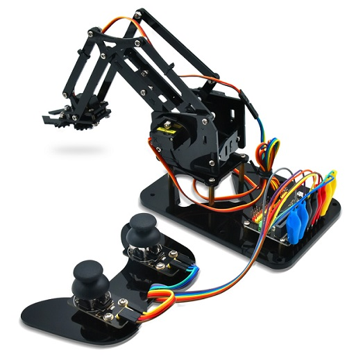
Micro:bit是一款由英国BBC 设计的ARM架构的单片机。它仅有信用卡一半大小，板载蓝牙，加速度计，电子罗盘，三个按钮，5 x 5 LED点阵，麦克风等，主要用于青少年的编程教育。
为了方便学习Micro: bit，我们团队特别研发了这个4自由度机械手臂Micro:bit学习套装。它是一个能够满足DIY制作，编程学习，亲子娱乐，教育培训需求的STEM教育机械手臂。这个套装中，我们利用Micro:bit主板和2个摇杆模块控制4个舵机的转动角度来实现4自由度机械手臂在不同的位置抓起或放下物体。
4自由度机械手臂Micro:bit学习套装，我们提供了MakeCode图形化编程和MicroPython语言编程两种教程，每种教程都有Micro:bit基础课程和Micro:bit机械手臂课程，适合不同年龄层次的爱好者。让我们进入Micro:bit世界一起学习吧。

2. 4自由度机械手臂Micro:bit学习套装的特点：          
（1）详细的安装方法。
（2）详细调试方法，教你从头开始学习Micro:bit。
（3）扩展性强：配置了Micro:bit 舵机扩展板，留有很多引脚，可以扩展其他的传感器和模块。
（4）多种控制：摇杆控制，手机APP蓝牙控制（苹果和安卓手机/平板都可）。
（5）学习基础编程：MakeCode图形化编程和MicroPython语言编程，可以接触底层代码。

3. 4自由度机械手臂Micro:bit学习套装的参数：          
- 工作电压：DC 5V
- 供电：Micro USB接口：DC 5V； 绿色接线柱：DC 6V-28V
- 最大输出电流：1.5A
- 最大耗散功率：32W
- 蓝牙遥控距离：空旷场地大概30-50米（实测）（使用环境最好是在空旷地带，周围无设备干扰）

4. 4自由度机械手臂Micro:bit学习套装的清单：            
当你收到这个4自由度机械手臂Micro:bit学习套装的时候，请跟着下面的清单一起清点一下，确保产品完整，如果发现有配件遗漏，请第一时间联系我们的销售人员。（KE3060带Micro:bit主板、KE3061不带Micro:bit主板）

|序号|规格|数量|图片|
| :--: | :--: | :--: | :--: |
| 1 |Micro:bit主板+官方彩盒包装|1| 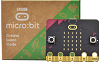|
| 2 |Micro:bit 16路舵机扩展板|1|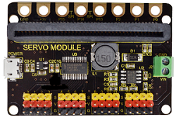|
| 3 |亚克力板|1|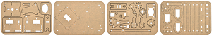|
| 4 |亚克力手柄|1|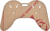|
| 5 |MeArm ABS圆柱形支架|1||
| 6 |180° 舵机| 3 |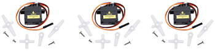|
| 7 |180° 舵机(金属齿轮)|1|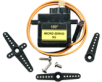|
| 8 |摇杆模块|2|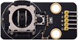|
| 9 |3D PS2摇杆帽|2||
| 10 |十字螺丝刀|1||
| 11 |镀锌扳手|1||
| 12 |M3*6MM 圆头 十字 螺钉|12|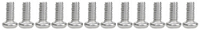|
| 13 |M3*10MM 圆头 十字 螺钉|15|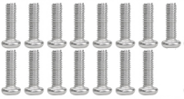|
| 14 |M3*14MM 平头 十字 螺钉|2| 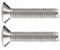 |
| 15 |M3*12MM 圆头 十字 螺钉|10|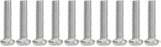|
| 16 |M3*24+6MM 单通铜柱|4|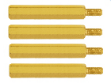|
| 17 |M3*6mm+6mm 单通铜柱|10|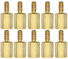|
| 18 |M3 六角螺母|20|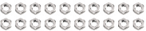|
| 19 |M3 六角自锁螺母|21|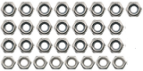|
| 20 |M2x5MM 十字自攻螺钉| 6 |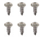|
| 21 | M3 金属垫片 | 12 ||
| 22 | M2x8MM 十字自攻螺钉 | 2 |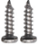|
| 23 |M3*16MM 平头 十字 螺钉|2|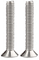|
| 24 |公对母20CM杜邦线| 4 ||
| 25 |鳄鱼夹转杜邦母头|8||
| 26 |黑色 3*100MM 扎带|7||
| 27 |6节 5号电池盒|1|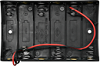|
| 28 |一字螺丝刀|1||
| 29 |USB线|1|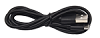|

