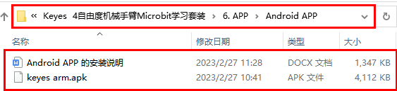
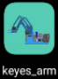
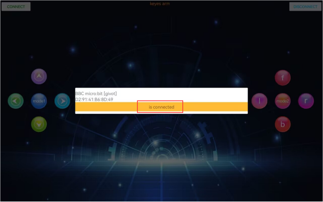
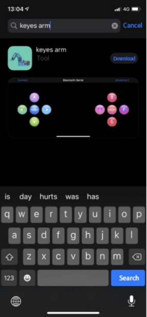
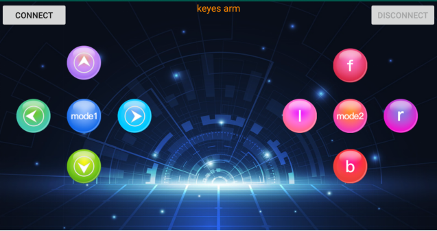

# APP

## Android APP 的安装说明

1.下载keyes arm.apk文件
A. 我们资料包中有提供Android apk安装包，在下图位置：

现将文件夹中的keyes arm.apk文件转移到安卓系统手机或平板电脑上。

B.使用手机浏览器中的扫描功能去扫二维码下载APP。

2.点击keyes arm.apk文件安装“**keyes arm**”APP，界面如下所示：

3.先开启手机/平板的蓝牙，再打开App，点击“CONNECT”进行蓝牙搜索，在搜索结果中寻找“BCC micro:bit”对话框，在“BCC micro:bit”对话框中点击“connect”即可连接蓝牙。当对话框的“connect”变成“is connected”，说明蓝牙连接成功。

## IOS APP 的安装说明

a.打开App Store。

b.在App Store中输入并搜索“keyes arm”，然后点击“Download”下载“keyes arm”APP。

c.“keyes arm”APP的界面如下所示：

d.先开启手机/iPad的蓝牙，再打开App，点击“CONNECT”进行蓝牙搜索，在搜索结果中寻找“BCC micro:bit”对话框，在“BCC micro:bit”对话框中点击“connect”即可连接蓝牙。当对话框的“connect”变成“is connected”，说明蓝牙连接成功。

